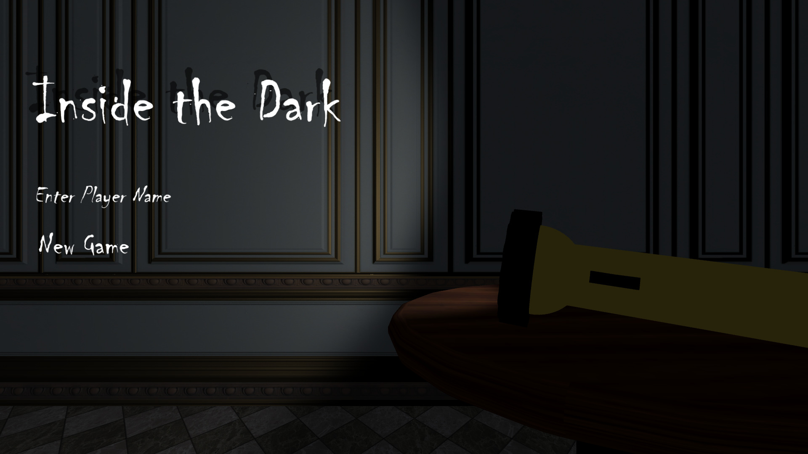
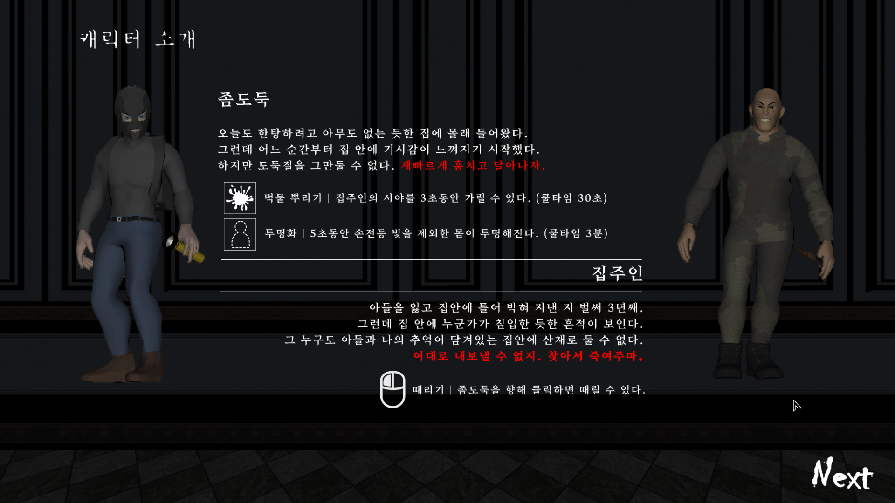
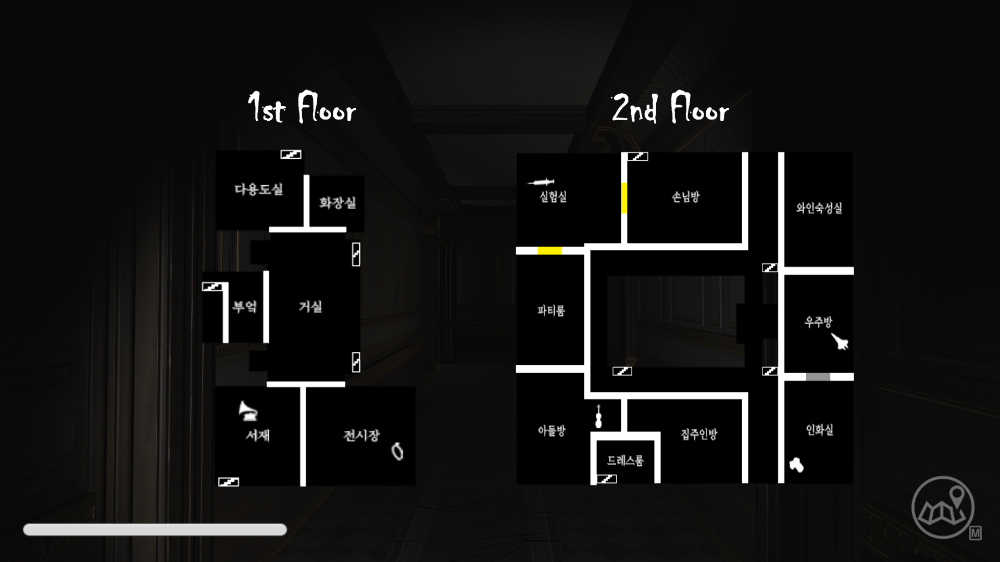
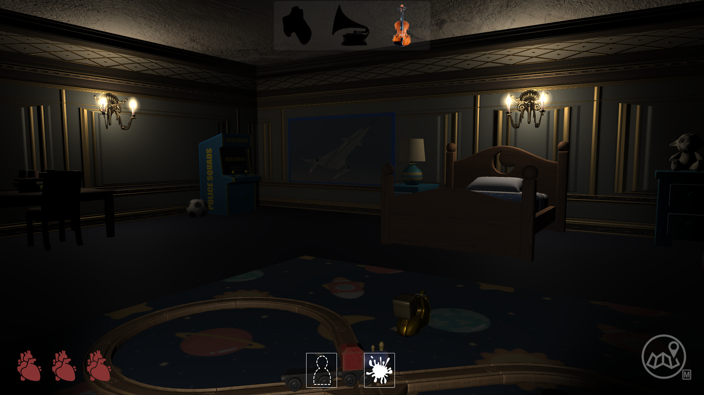
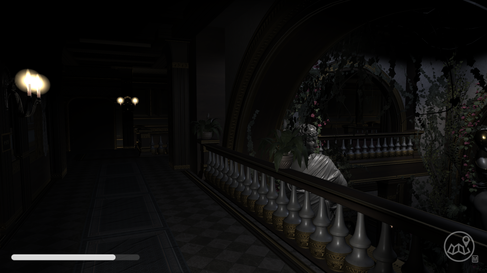

# Inside The Dark

### 2021 숭실대 글로벌미디어학부 졸업전시회(05.21 ~ 05.23) 프로젝트입니다  
* Unity
* Maya
* Fusion360

## 게임 장르
```
멀티플레이 공포 게임
```

## 게임 설명
```
한정된 저택 공간에서 일어나는 집주인과 좀도둑의 죽음의 술래잡기 공포게임
```
## 게임 목표
```
-좀도둑 : 화면 맨 위의 검정 실루엣을 보고 물건 3개를 훔쳐 탈출하면 승리
-집주인 : 좀도둑이 물건들을 다 찾기 전까지 총 3번을 칼로 찔러 이기면 승리
```
## 게임 화면

### 시작화면 UI


### 캐릭터 설명 UI


### 저택 Map UI


### 좀도둑 플레이 화면 UI


### 집주인 플레이 화면 UI



